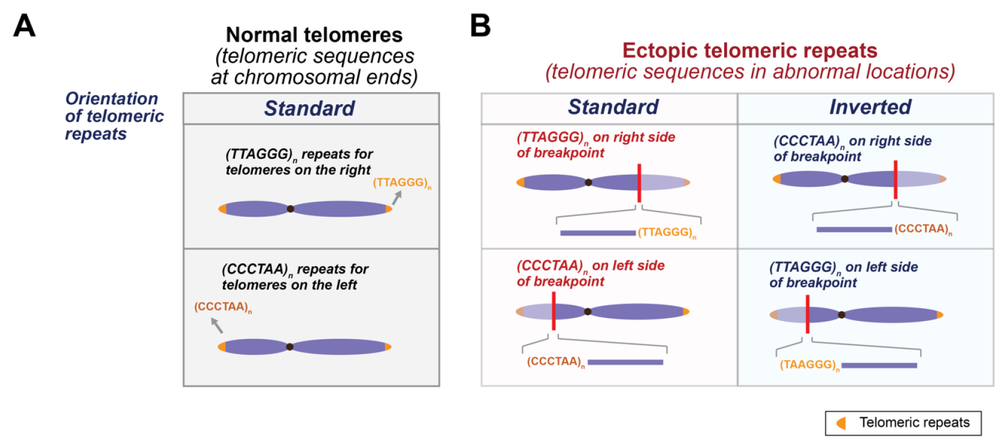

# TelFuse

TelFuse is an approach to identify ectopic telomeric repeat sequences (i.e. telomeric repeat sequences in abnormal locations) from short-read data. Telomeric repeat sequences are typically found at the chromosomal ends. However, they can also be found in abnormal locations in the cancer genome, in either the standard orientation relative to a breakpoint (i.e. same as normal telomeres), or in the inverted orientation.




# Requirements
- Samtools (version >=1.10)
- Perl
- Python (version >=3.x)
- BWA-MEM

# How to use?

## 1. Extract candidate sites from single sample

To identify candidate sites from a single sample (bam file), use the following command:
```
python extract_sites_sample.py <sample_bam> <reference_genome_fasta> <output_label>
```

This will generate a file ending in the extension `.telomeric.aligned_ref.softclipped.sites.aggregated` corresponding to a list of candidate sites found from a single sample

## 2. Aggregate, annotate, and filter sites from multiple samples

To then aggregate the candidate sites from multiple samples, put the file with the extension `.telomeric.aligned_ref.softclipped.sites.aggregated` from the previous step into a single folder. If there are multiple samples, then there should be one file for each sample

Then run the following command
```
python aggregate_samples_and_annotate.py <folder_with_candidate_sites> <output_label> <reference_genome_fasta>
```


